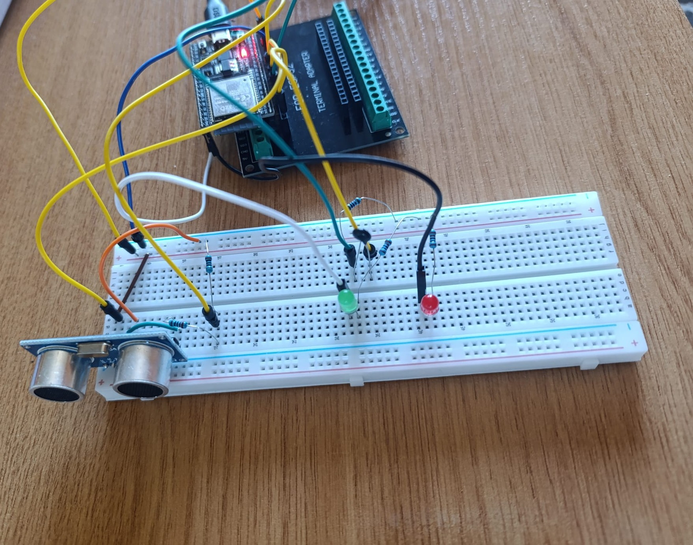
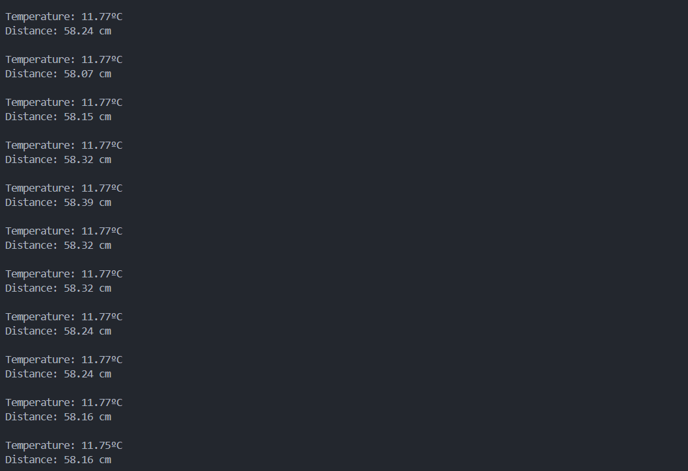
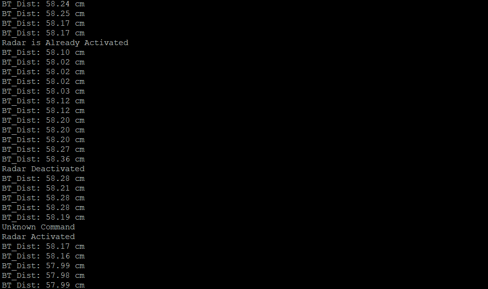

# ESP32 RTOS Dynamic Radar

An event-driven, real-time embedded security system built on the ESP32. This project leverages FreeRTOS to manage concurrent tasks, ensuring non-blocking sensor acquisition, dynamic environmental calibration, and asynchronous remote control via a Bluetooth CLI.

## 📸 Project Showcase

**Hardware Proof of Concept** 

**Real-time Output & Bluetooth CLI** *Left: Serial Monitor with thermal compensation. Right: Asynchronous Bluetooth commands.*

  
  

## 🧠 System Architecture Overview

The firmware is designed around a multithreaded RTOS architecture, utilizing Inter-Process Communication (IPC) mechanisms to ensure thread safety and eliminate race conditions.

* **Task 1: Radar Core (High Priority):** Handles the HC-SR04 ultrasonic sensor. Uses hardware interrupts (ISRs) for precise echo timing and implements a Circular Buffer with a Moving Average Filter to mitigate physical noise.
* **Task 2: Thermal Compensation (Low Priority):** Reads an NTC thermistor via ADC. Applies the Beta parameter equation to recalculate the speed of sound dynamically, compensating for ambient temperature drifts.
* **Task 3: Feedback & UI:** Consumes filtered data via FreeRTOS Queues. Manages local hardware alarms (LED indicators) in real-time.
* **Task 4: Bluetooth CLI:** Asynchronous command-line interface allowing remote system activation/deactivation via Event Groups.

## ⚙️ Key Technical Features

* **RTOS Primitives:** Extensive use of `QueueHandle_t` for data passing, `SemaphoreHandle_t` (Mutexes) for thread-safe serial logging, and `EventGroupHandle_t` for system state control.
* **Non-Blocking Logic:** Elimination of `delay()` loops in favor of RTOS ticks (`vTaskDelay`) and hardware timers, except for strict microsecond atomic triggers.
* **Dynamic Sound Speed:** Replaces the static $343 m/s$ constant with a real-time calculated variable based on the environment physical state.

## 🔌 Hardware Stack & Wiring

* **Microcontroller:** ESP32 Development Board
* **Distance Sensor:** HC-SR04
  * `TRIG` -> GPIO 32
  * `ECHO` -> GPIO 25
* **Temperature Sensor:** 10k NTC Thermistor (High-Side Voltage Divider configuration)
  * `ADC` -> GPIO 34
* **Actuators:** Status LEDs
  * `GREEN_LED` (Heartbeat/Active) -> GPIO 22
  * `RED_LED` (Alarm) -> GPIO 23

## 🚀 How to Build

1. Clone this repository.
2. Open the project in [PlatformIO](https://platformio.org/) (VS Code extension).
3. Build and flash the firmware to the ESP32.
4. Open the Serial Monitor at `115200` baud rate for debugging.
5. Connect a Bluetooth Terminal app to `ESP32_BT` to access the CLI commands (`on` / `off`).